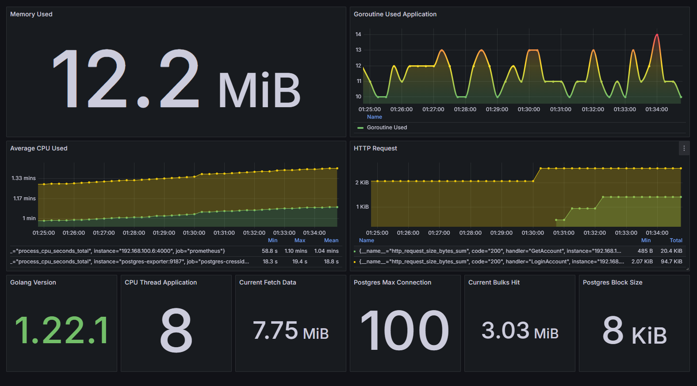
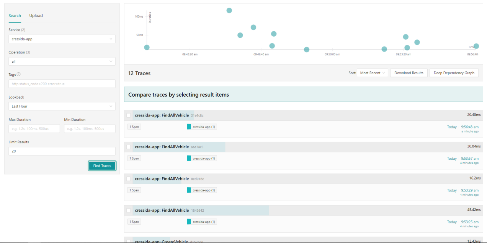

# Cressida


## Description
Cressida about a project, where this project create API service transporter. In this project has implementation opentelemetry for tracing endpoint / function and collect some metric ( gauge, summary, histogram ) per endpoint. This project use golang with [gorilla](https://github.com/gorilla/mux) for route HTTP endpoint. Go to `http://[ip]:[port]/docs/` for detail documentation API

## Requirements
- [Go](https://golang.org/) 1.18 or higher
- [Docker](https://www.docker.com/) 20.10.17 or higher
- [Docker Compose](https://docs.docker.com/compose/) 1.29.
- [Make](https://www.gnu.org/software/make/) 4.3 or higher
- [Prometheus](https://prometheus.io/) latest version
- [Grafana](https://grafana.com/) latest version
- [Jaeger](https://www.jaegertracing.io/) latest version
- [OpenTelemetry](https://opentelemetry.io/) latest version

## Library
- [Mux](https://github.com/gorilla/mux)
- [Prometheus Client Go](https://github.com/prometheus/client_golang)
- [OpenTelemetry Client Go](https://github.com/open-telemetry/opentelemetry-go)
- [OpenTelemetry Collector](https://github.com/open-telemetry/opentelemetry-collector)

## Installation
first, clone this repository
```bash
$ git clone https://github.com/rulanugrh/cressida.git
```

after that you can running `make install_depedency_[YOUR-OS]`
```bash
$ make install_depedency_mac

# linux
$ make install_depedency_linux
```
and then, you can run this command
```bash
$ make up
```

## Load Test

#### Vehicle
```bash
# for load test vehicle by id
$ make load_test_get_vehicle_by_id

# for load test get all vehicle
$ make load_test_get_all_vehicle

# for load test post vehicle
$ make load_test_post_vehicle
```

#### Transporter
```bash
# for load test transporter by id
$ make load_test_get_transporter_by_id

# for load test get all transporter
$ make load_test_get_all_transporter

# for load test post transporter
$ make load_test_post_transporter
```

#### User
```bash
# for load test user register
$ make load_test_user_register
```

## Grafana Output


## Jaeger Output
